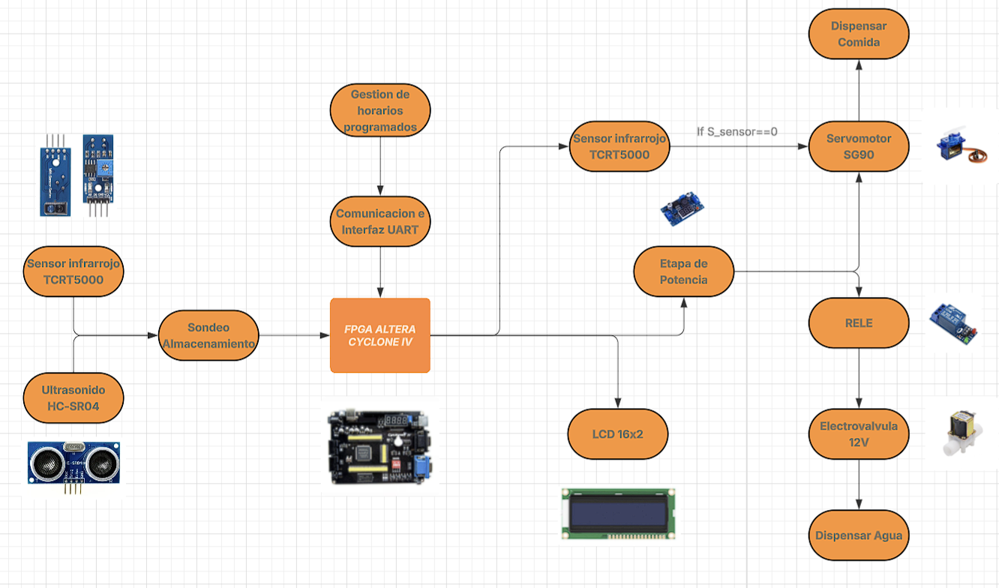
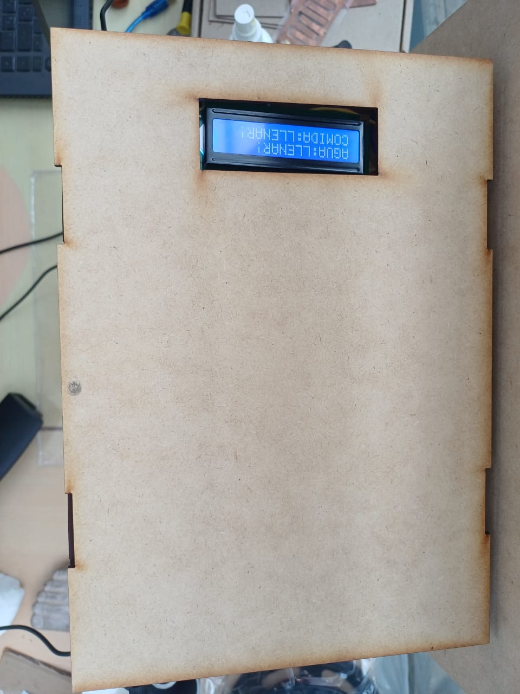
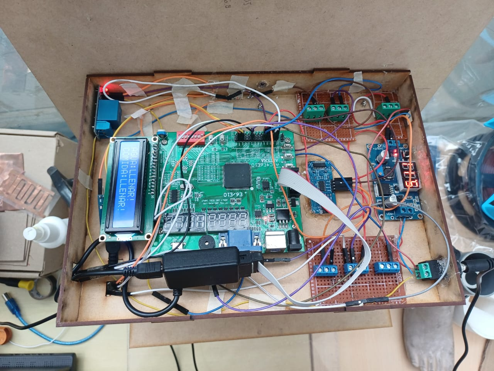
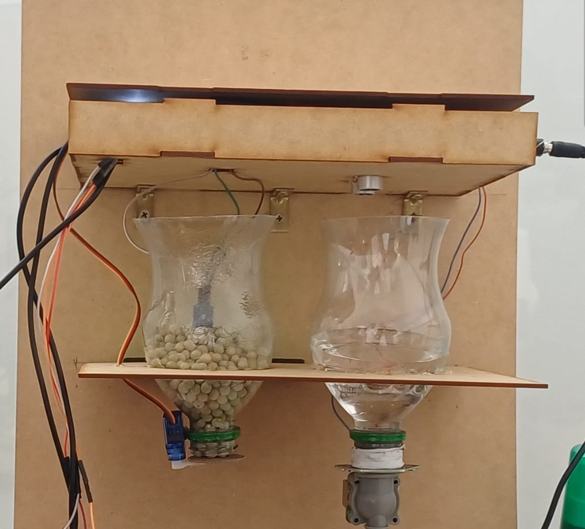

# Proyecto final - Electrónica Digital 1 - 2025-II

# Integrantes

# Nombre del proyecto

# Documentación
## Descripción de la arquitectura

## Arquitectura del sistema Feed-Link

La arquitectura del sistema **Feed-Link** se basa en una **FPGA Altera Cyclone IV** como unidad de control central, encargada de recibir la información proveniente de los sensores, procesarla de acuerdo con la lógica de control implementada en hardware y generar las señales necesarias para accionar los actuadores y actualizar las interfaces de usuario.  

En la **Figura 1** se presenta el diagrama de bloques general del sistema, donde se observan los principales módulos de sensado, actuación, potencia y comunicación que conforman el dispensador automático de alimento y agua para mascotas.

Figura 1: Diagrama de bloques general del sistema
 

---

## Módulos de sensado

El sistema cuenta con dos sensores principales, cada uno asociado a un tipo de insumo a monitorear:

### Sensor infrarrojo TCRT5000
Se utiliza para detectar la presencia de concentrado en el compartimiento de almacenamiento. Este sensor se ubica a una altura determinada dentro del contenedor, de modo que, cuando el nivel de alimento desciende por debajo de dicho punto, la ausencia de material frente al sensor genera una señal digital que la FPGA interpreta como condición de bajo nivel de concentrado.

### Sensor ultrasónico HC-SR04
Se emplea para estimar la distancia entre la parte superior del depósito de agua y la superficie del líquido. A partir de la medición del tiempo de vuelo del pulso ultrasónico, la FPGA calcula una distancia aproximada y la compara con umbrales predefinidos para determinar si el nivel de agua es adecuado o si se requiere un re-fill del contenedor.

Ambos sensores entregan señales digitales que son acondicionadas y leídas por la FPGA, lo que permite actualizar en tiempo real el estado de los depósitos de alimento y agua.

---

## Etapa de potencia y actuadores

Para accionar mecánicamente la dispensación de alimento y agua, se dispone de una etapa de potencia intermedia entre la FPGA y los actuadores, con el fin de aislar y adaptar los niveles de tensión y corriente:

### Servomotor SG90
Se encarga de abrir y cerrar la compuerta del compartimiento de concentrado. La FPGA genera una señal PWM cuya anchura de pulso determina la posición del eje del servo, permitiendo controlar el tiempo de apertura y, por ende, la cantidad aproximada de alimento dispensado.

### Electroválvula de 12 V
Regula el flujo de agua hacia el recipiente de la mascota. Dado que la válvula opera a 12 V y requiere corrientes superiores a las que puede entregar la FPGA, se utiliza un módulo de relé como etapa de potencia, el cual conmuta la alimentación de la válvula a partir de una señal de control digital proveniente de la FPGA.

La etapa de potencia garantiza que la lógica de control permanezca protegida frente a las corrientes y transitorios asociados a las cargas inductivas (servo y válvula), manteniendo la integridad del sistema.

---

## Unidad de control: FPGA Altera Cyclone IV

La **FPGA Altera Cyclone IV** constituye el núcleo del sistema y se encarga de:

- Leer periódicamente las señales de los sensores **TCRT5000** y **HC-SR04**.  
- Ejecutar la lógica de decisión para determinar cuándo accionar el servomotor o la electroválvula, según los niveles detectados y los modos de operación definidos.  
- Generar las señales PWM y de control digital hacia la etapa de potencia.  
- Actualizar la información mostrada en la pantalla LCD.  
- Gestionar la comunicación serie mediante la interfaz **UART**.

La implementación en hardware permite un procesamiento paralelo y determinista, adecuado para el manejo simultáneo de varios módulos y para la generación precisa de señales de temporización.

---

## Interfaz de usuario y comunicación

El sistema dispone de dos mecanismos principales de interacción con el usuario:

### Pantalla LCD 16×2
Se utiliza como interfaz local para mostrar información relevante, como el estado de los depósitos de alimento y agua, mensajes de alerta cuando se detectan niveles bajos y, eventualmente, parámetros de configuración básicos del sistema. La FPGA envía los datos al LCD siguiendo el protocolo de control correspondiente.

### Interfaz UART
Permite establecer un canal de comunicación serie entre la FPGA y un dispositivo externo, por ejemplo, un computador o un microcontrolador. A través de esta interfaz es posible supervisar el funcionamiento del dispensador, registrar eventos y, en futuras versiones, modificar parámetros de operación de forma remota.

La combinación de la interfaz local mediante LCD y la comunicación UART proporciona una arquitectura flexible, que facilita tanto el uso cotidiano del dispositivo como su ampliación hacia escenarios de monitoreo y control remoto.

---

## Uso de recursos de la FPGA

El módulo de **Quartus** reporta un uso de capacidad de la FPGA del **9 %**, correspondiente a:

- **879 elementos lógicos**
- **540 registros**
- **20 pines utilizados**

Estos resultados evidencian que el diseño es eficiente en términos de recursos y deja un margen amplio para futuras ampliaciones del sistema.

## Diagramas de la arquitectura

HOLA

## Simulaciones

## Evidencias de implementación

# Proyecto Feed-Link 🐾🍽️

Sistema automatizado para la dispensación de alimento y agua para mascotas, basado en lógica digital implementada en FPGA. El proyecto integra sensores, actuadores y una interfaz de usuario sencilla, permitiendo un funcionamiento autónomo y confiable.

---

## Vista general del prototipo

### Figura 2. Proyecto Feed-Link – Vista tipo pájaro para el usuario

En la parte superior del prototipo se encuentra la tapa en MDF donde se integra la interfaz principal para el usuario. En esta superficie solo es visible la pantalla LCD 16×2, embebida en un recorte rectangular que permite leer fácilmente los mensajes del sistema. A través de esta pantalla se muestran estados como **“AGUA: LLENAR”** o **“COMIDA: LLENAR”**, así como otras indicaciones de funcionamiento, de modo que el usuario pueda conocer rápidamente si es necesario recargar alguno de los depósitos o si se ha ejecutado una rutina de dispensación.  
El resto de la electrónica queda oculta debajo de la tapa, lo que mejora la apariencia del dispositivo y protege los componentes.

---

## Vista interna del sistema

### Figura 3. Proyecto Feed-Link – Vista tipo pájaro interna

Al retirar la tapa superior se observa la vista interna tipo “pájaro” del sistema, donde se aloja toda la electrónica de control. En el centro se encuentra la tarjeta **FPGA Altera Cyclone IV**, encargada de ejecutar la lógica digital del dispensador. A su alrededor se distribuyen las diferentes tarjetas y módulos: la pantalla LCD, el módulo de relé para la electroválvula, los módulos de conexión a los sensores **TCRT5000** y **HC-SR04**, la etapa de potencia para el servomotor y las tarjetas de prototipado donde se realizan las interconexiones necesarias.  
También se aprecia el ruteo del cableado de señal y alimentación, así como la fuente encargada de suministrar energía al sistema.

---

## Módulo de almacenamiento

### Figura 4. Proyecto Feed-Link – Almacenamiento

El módulo de almacenamiento del proyecto **Feed-Link** está conformado por dos depósitos independientes, uno para concentrado y otro para agua, montados sobre una estructura en MDF de dos niveles. En la parte superior se ubican los recipientes principales, que funcionan como contenedores de reserva: a la izquierda se dispone el depósito de alimento sólido y a la derecha el depósito de agua. Ambos se conectan, mediante adaptaciones en plástico tipo botella, a los conductos inferiores por donde se realiza la dispensación hacia el plato de la mascota.

En el compartimiento de concentrado se fijó el sensor infrarrojo **TCRT5000** en la zona inferior del depósito, de manera que detecta la presencia o ausencia de alimento en un nivel crítico definido. Cuando el nivel baja por debajo de ese punto, el sensor informa a la FPGA que el almacenamiento está por agotarse. En la salida de este mismo depósito se encuentra el mecanismo de apertura accionado por el servomotor **SG90**, que controla el flujo de las pepas hacia el plato.

Por su parte, el depósito de agua se conecta en la parte inferior a la electroválvula de **12 V**, encargada de controlar el paso del líquido durante los ciclos de dispensación. El sensor ultrasónico **HC-SR04** se ubica en la parte superior del tanque (no visible en esta imagen) y permite estimar el nivel de agua disponible, generando alertas cuando es necesario realizar un rellenado. El conjunto mecánico asegura que ambos insumos —comida y agua— se mantengan almacenados de forma estable y puedan ser dosificados por el sistema de control sin intervención constante del usuario.

---

## Vista frontal del sistema

### Figura 5. Proyecto Feed-Link – Vista frontal del depósito

En la vista frontal del prototipo del sistema **Feed-Link** se observa la estructura principal en MDF que soporta los módulos de almacenamiento y dispensación de alimento y agua. En la parte superior se encuentra la plataforma donde se fija la electrónica de control y el cableado que conecta la FPGA con los sensores y actuadores. Debajo de esta, se ubican los dos depósitos transparentes: el de la izquierda destinado al concentrado sólido y el de la derecha destinado al agua.

---

